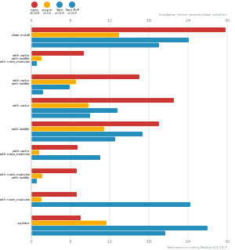
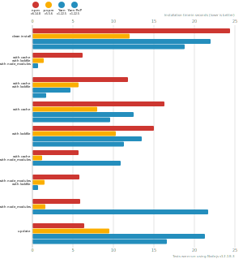
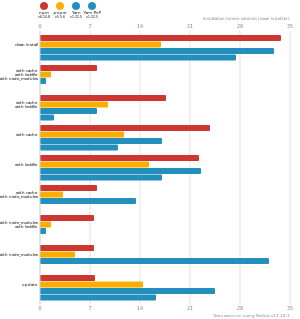
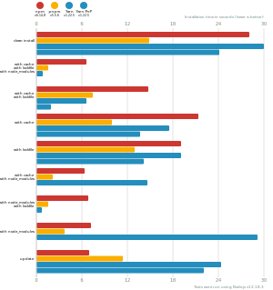

# Benchmarks of JavaScript Package Managers

This benchmark compares the performance of [npm](https://github.com/npm/cli), [pnpm](https://github.com/pnpm/pnpm) and [yarn](https://github.com/yarnpkg/yarn).

Here's a quick explanation of all tests:

- `clean install`: How long it takes to run a totally fresh install: no lockfile present, no packages in the cache, no `node_modules` folder.
- `with cache`, `with lockfile`, `with node_modules`: After the first install is done, the install command is run again.
- `with cache`, `with lockfile`: When a repo is fetched by a developer and installation is first run.
- `with cache`: Same as the one above, but the package manager doesn't have a lockfile to work from.
- `with lockfile`: When an installation runs on a CI server.
- `with cache`, `with node_modules`: The lockfile is deleted and the install command is run again.
- `with node_modules`, `with lockfile`: The package cache is deleted and the install command is run again.
- `with node_modules`: The package cache and the lockfile is deleted and the install command is run again.
- `updated dependencies`: Without deleting the previous installation the versions of all dependencies in the `package.json` are set to `'*'` and the install command is run again.

## React App

The app's `package.json` [here](./fixtures/react-app/package.json)

| action  | cache | lockfile | node_modules| npm | Yarn | pnpm |
| ---     | ---   | ---      | ---         | --- | --- | --- |
| install |       |          |             | 15s | 13.7s | 12.1s |
| install | ✔     | ✔        | ✔           | 4.5s | 543ms | 737ms |
| install | ✔     | ✔        |             | 8.2s | 3s | 3.2s |
| install | ✔     |          |             | 10s | 7s | 5.7s |
| install |       | ✔        |             | 10.4s | 8.9s | 9.7s |
| install | ✔     |          | ✔           | 4.5s | 5.9s | 1.3s |
| install |       | ✔        | ✔           | 4.7s | 531ms | 688ms |
| install |       |          | ✔           | 4.4s | 12.7s | 2.8s |
| update  | n/a   | n/a      | n/a         | 5.5s | 19.5s | 13.7s |

## Ember App

The app's `package.json` [here](./fixtures/ember-quickstart/package.json)

| action  | cache | lockfile | node_modules| npm | Yarn | pnpm |
| ---     | ---   | ---      | ---         | --- | --- | --- |
| install |       |          |             | 12.6s | 13.3s | 9.5s |
| install | ✔     | ✔        | ✔           | 4s | 511ms | 683ms |
| install | ✔     | ✔        |             | 6.7s | 2.5s | 2.9s |
| install | ✔     |          |             | 8.5s | 8.7s | 5.1s |
| install |       | ✔        |             | 9.2s | 7.7s | 8s |
| install | ✔     |          | ✔           | 3.8s | 7.9s | 985ms |
| install |       | ✔        | ✔           | 4.2s | 480ms | 683ms |
| install |       |          | ✔           | 3.9s | 15s | 1.6s |
| update  | n/a   | n/a      | n/a         | 2.8s | 14.1s | 8.5s |

## Angular App

The app's `package.json` [here](./fixtures/angular-quickstart/package.json)

| action  | cache | lockfile | node_modules| npm | Yarn | pnpm |
| ---     | ---   | ---      | ---         | --- | --- | --- |
| install |       |          |             | 17.9s | 19.4s | 14.1s |
| install | ✔     | ✔        | ✔           | 4.8s | 528ms | 727ms |
| install | ✔     | ✔        |             | 9.7s | 3.9s | 4.1s |
| install | ✔     |          |             | 11.3s | 9.8s | 6.9s |
| install |       | ✔        |             | 12.9s | 11.8s | 12.1s |
| install | ✔     |          | ✔           | 4.6s | 8.5s | 5.1s |
| install |       | ✔        | ✔           | 4.9s | 511ms | 828ms |
| install |       |          | ✔           | 4.7s | 17.8s | 11.3s |
| update  | n/a   | n/a      | n/a         | 3.2s | 24.5s | 9.3s |

## Medium Size App

The app's `package.json` [here](./fixtures/medium-size-app/package.json)

| action  | cache | lockfile | node_modules| npm | Yarn | pnpm |
| ---     | ---   | ---      | ---         | --- | --- | --- |
| install |       |          |             | 15.9s | 17.7s | 12.4s |
| install | ✔     | ✔        | ✔           | 4.3s | 494ms | 727ms |
| install | ✔     | ✔        |             | 7.9s | 3.2s | 3.5s |
| install | ✔     |          |             | 10s | 11.5s | 5.7s |
| install |       | ✔        |             | 11s | 8.9s | 9.8s |
| install | ✔     |          | ✔           | 4.3s | 9.1s | 1.8s |
| install |       | ✔        | ✔           | 4.5s | 472ms | 750ms |
| install |       |          | ✔           | 4.4s | 16.2s | 4.5s |
| update  | n/a   | n/a      | n/a         | 2.8s | 28.1s | 18.4s |

## Lots of Files

The app's `package.json` [here](./fixtures/alotta-files/package.json)

| action  | cache | lockfile | node_modules| npm | Yarn | pnpm |
| ---     | ---   | ---      | ---         | --- | --- | --- |
| install |       |          |             | 22.7s | 21.7s | 13.7s |
| install | ✔     | ✔        | ✔           | 4.8s | 572ms | 838ms |
| install | ✔     | ✔        |             | 10.4s | 6.1s | 3.7s |
| install | ✔     |          |             | 12s | 18.4s | 6.8s |
| install |       | ✔        |             | 14.1s | 13.6s | 10.8s |
| install | ✔     |          | ✔           | 5.5s | 14.8s | 2s |
| install |       | ✔        | ✔           | 5.5s | 550ms | 831ms |
| install |       |          | ✔           | 4.5s | 24.5s | 4.6s |
| update  | n/a   | n/a      | n/a         | 3.3s | 26.6s | 10.6s |

